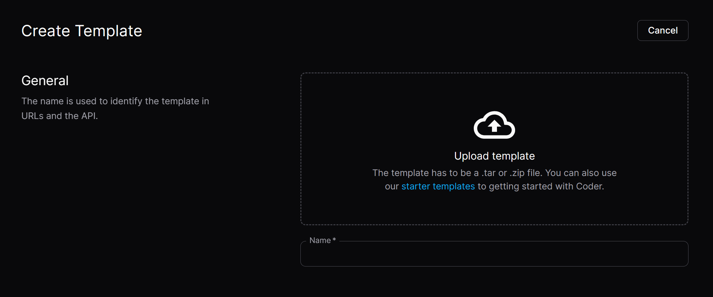

<!--   -->

<h1>
  coderv2-templates
</h1>

  Coder CDE v2 workspace terraform templates.

[![Pull Requests][github-pr-badge]][github-pr-link]
[![Issues][github-issue-badge]][github-issue-link]
[![License][github-license-badge]](LICENSE)

<!-- Main Body -->

## Introduction
Workspace templates for Coder Cloud Development Environments v2 OSS in HashiCorp Terraform format.

## Usage
Choose a template in the folders (except the `images` folder), and upload all the files in the folder.  

For more information about creating and using a template, please refer to [Templates - Coder Docs](https://coder.com/docs/templates).

To fill the parameters in the templates automatically when a workspace is created, please refer to [Open in Coder - Coder Docs](https://coder.com/docs/templates/open-in-coder).

## Create your own
Learn Terraform syntax: [Terraform Language Documentation](https://developer.hashicorp.com/terraform/language)

Find Coder modules: [Coder Registry](https://registry.coder.com/modules)

<!-- /Main Body -->

  
[![BACK TO TOP][back-to-top-button]](#readme-top)

---

  Copyright &copy; 2024-present <a target="_blank" href="https://github.com/katorlys">Katorly Lab</a>

[![License][github-license-badge-bottom]](LICENSE)

[back-to-top-button]: https://img.shields.io/badge/BACK_TO_TOP-151515?style=flat-square
[github-pr-badge]: https://img.shields.io/github/issues-pr/katorlys/coderv2-templates?label=pulls&labelColor=151515&color=79E096&style=flat-square
[github-pr-link]: https://github.com/katorlys/coderv2-templates/pulls
[github-issue-badge]: https://img.shields.io/github/issues/katorlys/coderv2-templates?labelColor=151515&color=FFC868&style=flat-square
[github-issue-link]: https://github.com/katorlys/coderv2-templates/issues
[github-license-badge]: https://img.shields.io/github/license/katorlys/coderv2-templates?labelColor=151515&color=EFEFEF&style=flat-square
<!-- https://img.shields.io/badge/license-CC_BY--NC--SA_4.0-EFEFEF?labelColor=151515&style=flat-square -->
[github-license-badge-bottom]: https://img.shields.io/github/license/katorlys/coderv2-templates?labelColor=151515&color=EFEFEF&style=for-the-badge
<!-- https://img.shields.io/badge/license-CC_BY--NC--SA_4.0-EFEFEF?labelColor=151515&style=for-the-badge -->